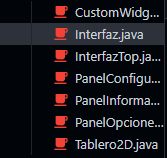
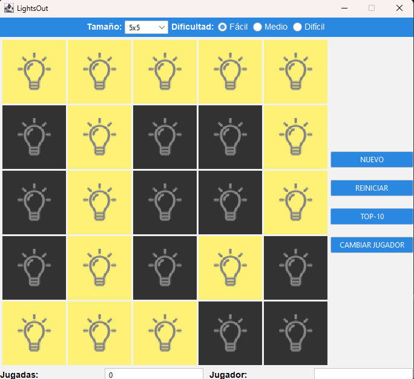
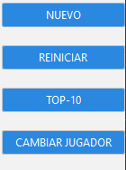

# Workshop-4-DPOO

This workshop was developed as part of the Object-Oriented Design and Programming course at the University of Los Andes during the first semester of 2023, using Java and the Swing framework.

## Game

To enjoy the gaming experience, simply call the `Main` method of the `Interface` class.

## Interface

## Configuration

The top panel offers the flexibility to adjust the size and difficulty of the game. To create a new board, simply press the "New" option. You have the option to choose from three default sizes (3x3, 5x5, and 7x7) and three difficulty levels (easy, medium, and difficult), with associated scores of 3, 5, and 7 respectively.

## Options

- **New:** Create a new board with the selected configuration.
- **Restart:** Returns the board to its initial state.
- **Top10:** Displays a window with the top 10 players and their scores.
- **Change player:** Allows the user to enter their name, which will conform to the model's format. This name will be considered for the top 10 if the player achieves an outstanding record.

## Information

This section allows you to view the number of plays and set a new username.

## Top 10 players

- Displays the top 10 records.
- The top three are highlighted with a special color.
- The fourth and fifth are also highlighted with a different color.
- The rest of the players retain the default color.
- Clicking on a record in the board changes its color.

