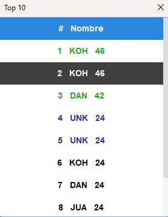

# Taller-4-DPOO
You can read the English version [here](https://github.com/ddi4z/Lights-Out/blob/main/ENGLISH.MD).

Este taller fue desarrollado como parte del curso de Diseño y Programación Orientado a Objetos en la Universidad de Los Andes durante el primer semestre del 2023, utilizando Java y el framework Swing.

## Juego

Para disfrutar de la experiencia de juego, simplemente llama al método `Main` de la clase `Interfaz`.

## Interfaz

## Configuración

El panel superior ofrece la flexibilidad de ajustar el tamaño y la dificultad del juego. Para crear un nuevo tablero, simplemente presiona la opción "Nuevo". Tienes la opción de elegir entre tres tamaños predeterminados (3x3, 5x5 y 7x7) y tres niveles de dificultad (fácil, medio y difícil), con puntuaciones asociadas de 3, 5 y 7 respectivamente.

## Opciones

- **Nuevo:** Crea un nuevo tablero con la configuración seleccionada.
- **Reiniciar:** Devuelve el tablero a su estado inicial.
- **Top10:** Muestra una ventana con los 10 mejores jugadores y sus puntuaciones.
- **Cambiar jugador:** Permite al usuario ingresar su nombre, el cual se ajustará al formato del modelo. Este nombre se considerará para el top 10 si el jugador logra un récord destacado.

## Información

Esta sección te permite visualizar la cantidad de jugadas y establecer un nuevo nombre de usuario.

## Top 10 jugadores

- Muestra los 10 mejores récords.
- Los tres mejores se destacan con un color especial.
- El cuarto y quinto también se resaltan con un color diferente.
- Los demás jugadores conservan el color por defecto.
- Al hacer clic en un registro del tablero, este cambia de color.

